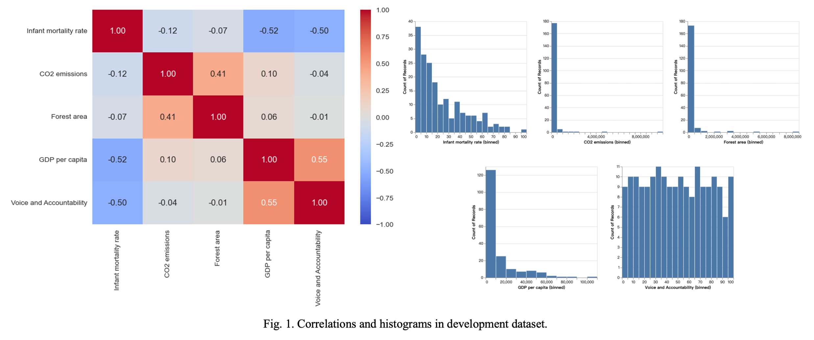
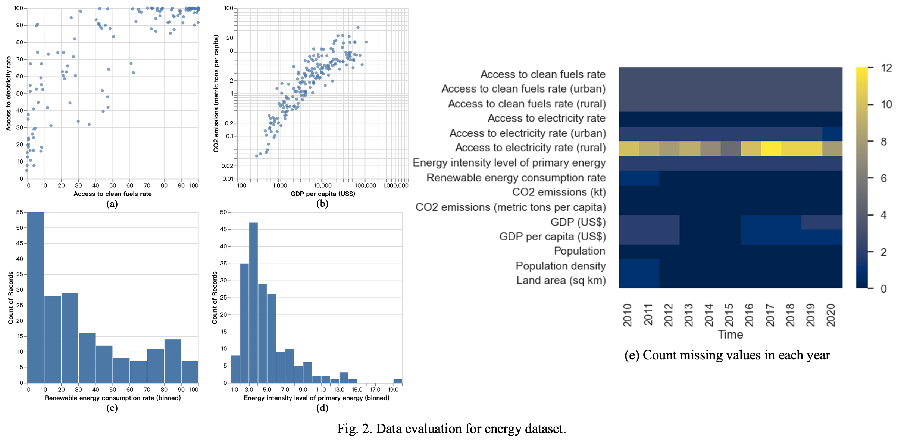

# Data Overview

This folder contains the datasets used in the analysis of energy outcomes based on countries' development levels from 2010 to 2020. The data used in this project is sourced from **The World Bank Open Data platform**.

## Datasets

### 1. **Countries' Development Levels (2015)**
   - This dataset contains indicators related to the development levels of countries in 2015.
   - It includes the following five key indicators:
     - **Infant mortality rate**: Reflects healthcare standards.
     - **CO2 emissions (total, kt)**: Indicates energy use.
     - **Forest area**: Signifies sustainable development potential.
     - **GDP per capita**: Reflects economic status.
     - **Voice and Accountability**: Measures citizens' involvement in government.
   - **Location**: `data/countries_development_2015.csv`

### 2. **Energy-Related Indicators (2010-2020)**
   - This dataset includes 15 indicators that capture energy-related outcomes for each country over the period from 2010 to 2020.
   - These indicators are grouped into five key aspects:
     - **Energy Accessibility**: Access to clean fuels rate, Access to electricity rate (urban and rural).
     - **Energy Efficiency**: Energy intensity level of primary energy.
     - **Renewable Energy**: Renewable energy rate.
     - **Emissions**: CO2 emissions (total and per capita).
     - **Economic Factors**: GDP (total and per capita).
   - The dataset also contains basic country information such as population, population density, and land area.
   - **Location**: `data/energy_indicators_2010_2020.csv`

## Data Exploration

### Data Preprocessing
- Some transformations and scaling are required before applying clustering algorithms like k-means.
- Missing values are present in the dataset, though they are minimal, with a maximum of only 12 missing entries (less than 7% of the total data). Care will be taken to handle potential problems caused by missing values during further analysis.

### Visualizations
- **Figure 1**: Correlations between the key indicators using a heatmap.  
  

- **Figures 2**: Distribution of the main indicators (energy accessibility, CO2 emissions, energy efficiency, renewable energy), and a heatmap showing missing values across the years.
  

## License

The datasets used in this project are sourced from **The World Bank Open Data platform** and are available under the **Creative Commons Attribution 4.0 International License (CC BY 4.0)**.

- **Data Source**: [World Bank Open Data](https://data.worldbank.org/)

The code and report in this project are licensed under the **MIT License**. See the [LICENSE](../LICENSE) file for more details.
