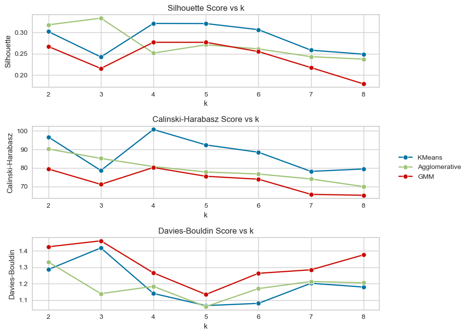
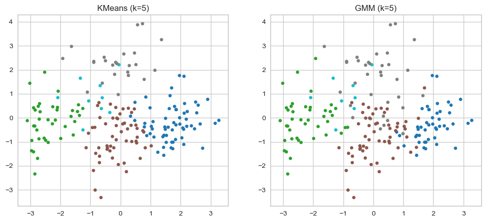
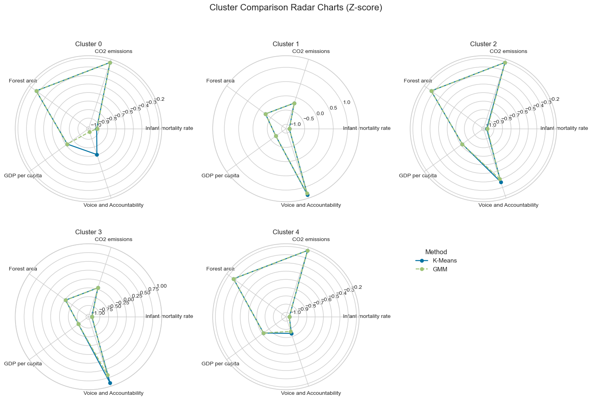

## Clustering Comparison Results (2025)

This extension study focuses on comparing clustering methods for countries' development levels using energy-related indicators.

### Validation Metrics within Clustering Methods 📊

#### Key Findings
- ✅ **K-Means:** Best performance for 4–5 clusters across all metrics.
- ⚠️ **GMM:** Similar to K-Means but slightly lower scores.
- ❌ **Agglomerative:** Less stable and lower overall performance.

### K-Means vs. GMM 🔄

Comparison of K-Means and GMM clustering with 5 clusters.

- ✨ **GMM:** Produces softer, probabilistic clusters.
- 📊 **K-Means:** Hard assignment, more distinct clusters.

**Indicator means across clusters show:**

- Apart from **Voice and Accountability** in Cluster 0, most indicators across all clusters are quite similar between K-Means and GMM.
- Some clusters show minor differences in indicator means depending on the clustering method.
